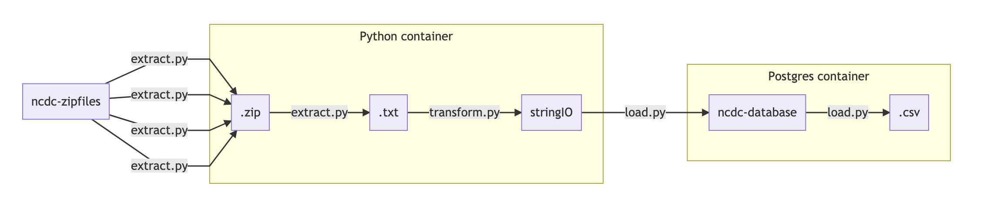

# ncdc-data-pipeline

Fetches, stores, and processes National Climatic Data Center dataset

## Description

The following diagram describes the pipeline's components and actions:

## How to

The components can be accessed and used easily locally with the following commands.

### Create containers

`docker-compose up`

### Enter containers

Python container: `docker exec -it python-etl /bin/bash`
Postgres container: `docker exec -it results-db /bin/bash`

### Run Python ETL in container

`python3 main.py run_pipeline --config_path './config.yml'`

As described on the diagram, the Python ETL performs the following actions:

#### extract.py

- Parallel download and extraction into .txt of .zip files
- Deletion of .zip files after use

#### transform.py

- Header and Data columns parsing into dictionary records
- Records transformation: 
    - drop columns
    - split datetime strings
    - empty values handling
    - type conversion
 - Deletion of .txt files after use

Results are yielded to limit memory usage.

#### load.py

- Records insertion
- Creation of partitioned .csv files

### Connect to Postgres database in container

`psql -h localhost -p 5432 ncdc testuser`

### Check database records from psql

`SELECT * FROM ncdc_data.results LIMIT 100;`

## Next steps: 

- [ ] Unit, integration and end-to-end testing
- [ ] Refactoring, better exception handling, corrupted or errored data handling
- [ ] Replacement of null values (e.g. -9999, -8888)

